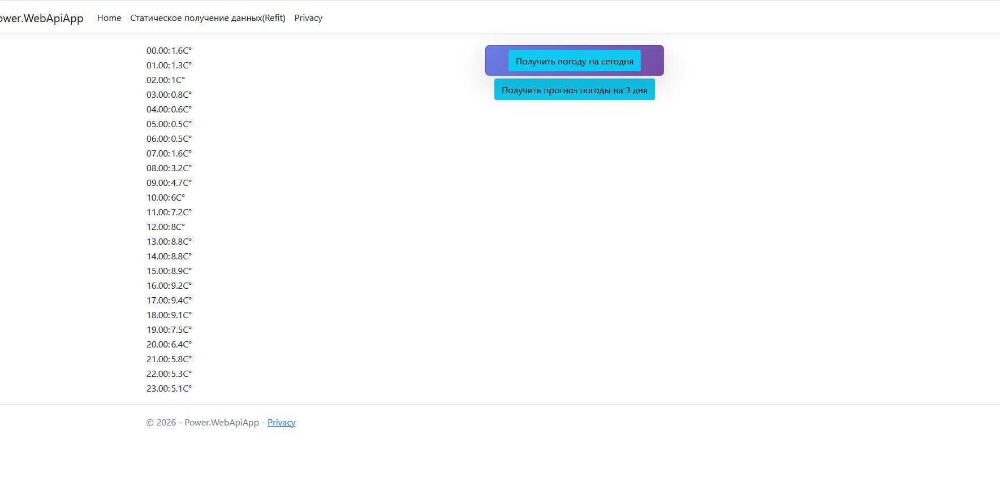
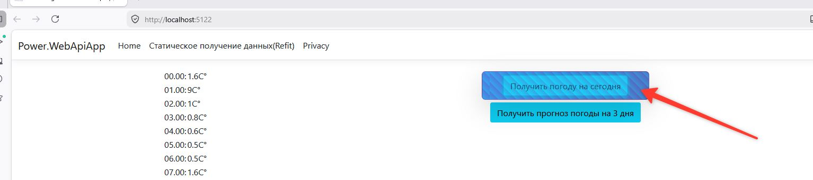
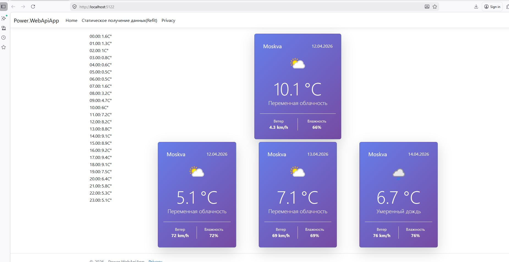
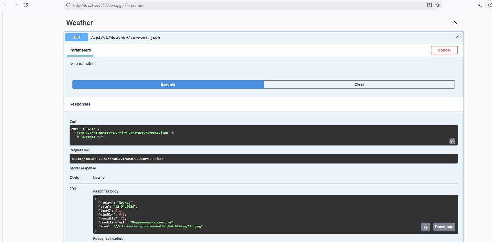
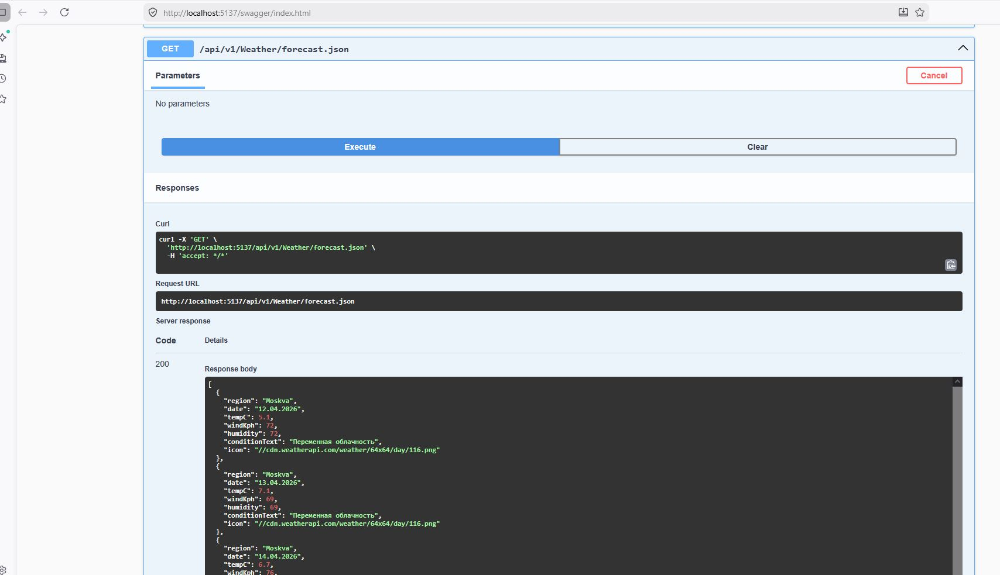
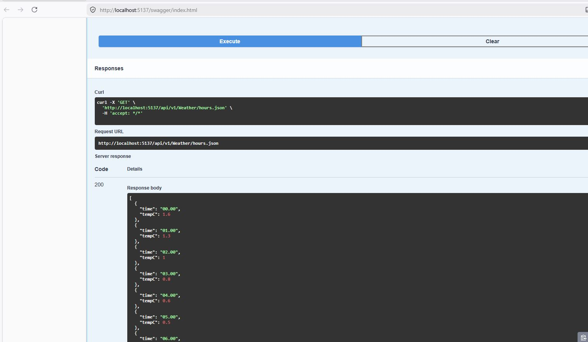
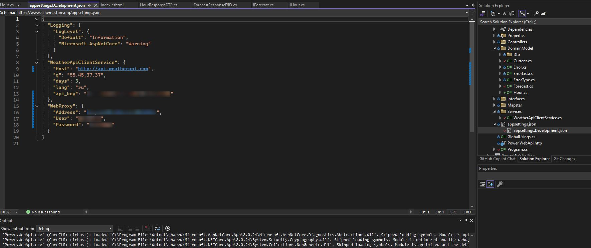
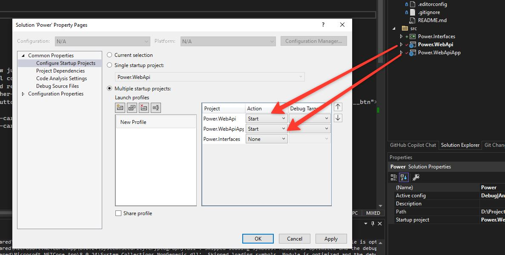

# Погодное веб-приложение на .Net Framework, 

Включает разделение на API и веб приложение. Веб приложение используюет как ajax так и прямые обращения `из под капота`(использоан refit для строгой типизации)
 - Отображение шаблонов jQuery + jsRender
 - Добавлена возможность отмены запроса (CancellationToken)
 - Работа с api.weatherapi.com через отдельный сервис (шина здесь избыточна по этому http)
 - Использоваты Nuget ```Refit``` - строгая типизация HttpClient, ```CSharpFunctionalExtensions``` - паттерн Result, ```Mapster``` - мапинг
 - Использование jQuery так как в вакансии указан был он


## Как выглядит Интерфейс до загрущки


## Встроенна возможность ***отмены загрузки при клике по лоадеру***


## Отображение ошибки, с кнопкой повторного запроса


## Полная загрузка



# Как выглядит API (as микросервис)




## Как запустить
привести в соответствие Power/src/Power.WebApiApp/appsettings.Development.json сборки Power.WebApi (будет передан отдельно)
```
{
  "Logging": {
    "LogLevel": {
      "Default": "Information",
      "Microsoft.AspNetCore": "Warning"
    }
  },
  "WeatherApiClientService": {
    "Host": "http://api.weatherapi.com",
    "q": "55.45,37.37",
    "days": 3,
    "lang": "ru",
    "api_key": "ваш ключ от api.weatherapi.com"
  },
  "WebProxy": {
    "Address": "ваш прокси сервер",
    "User": "user от прокси",
    "Password": "пароль от прокси"
  }
}
```
WebProxy можно опустить или Fiddler по желанию



перед запуском убедится что запускаются две сборки

(Power.slnLaunch.user)
```
[
  {
    "Name": "New Profile",
    "Projects": [
      {
        "Path": "src\\Power.WebApi\\Power.WebApi.csproj",
        "Action": "Start"
      },
      {
        "Path": "src\\Power.WebApiApp\\Power.WebApiApp.csproj",
        "Action": "Start"
      }
    ]
  }
]
```

## Расширяемость и исключение ошибок
  - Использование Microsoft.Extensions.Http.Polly для нестабильных соединений
  - использование агрегации ошибок и отдельного класса Error дают возможность расширять отображение/логирование ошибок
  - Строгая типизиция запросов позволяет исключать ошибки на этапе неверных запросов(Refit)
  - Создание отдельной сборки(Power.Interfaces) для интерфейсов работы с кастомным API
  - Маппинг Mapster (Automaper возможно станет платным)
